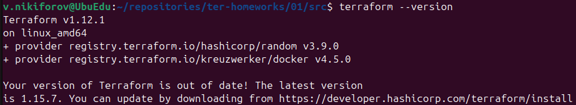
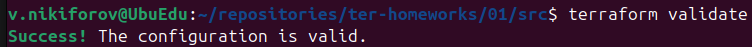
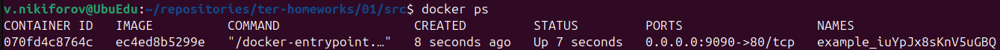
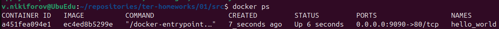
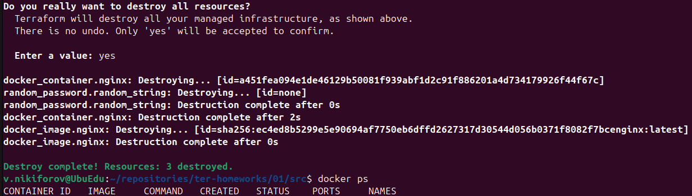
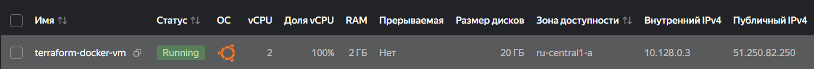
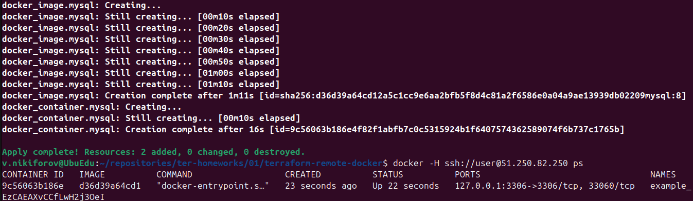
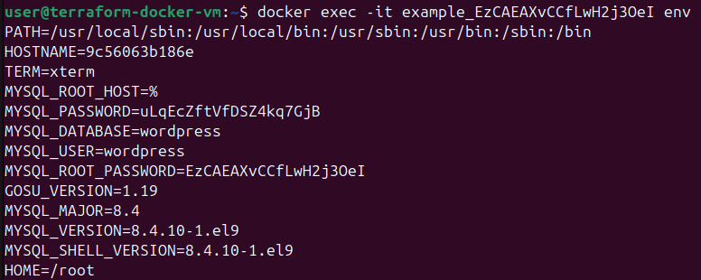
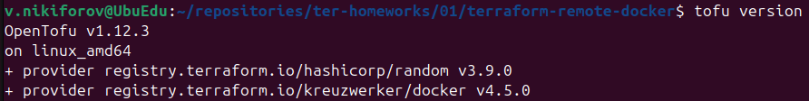
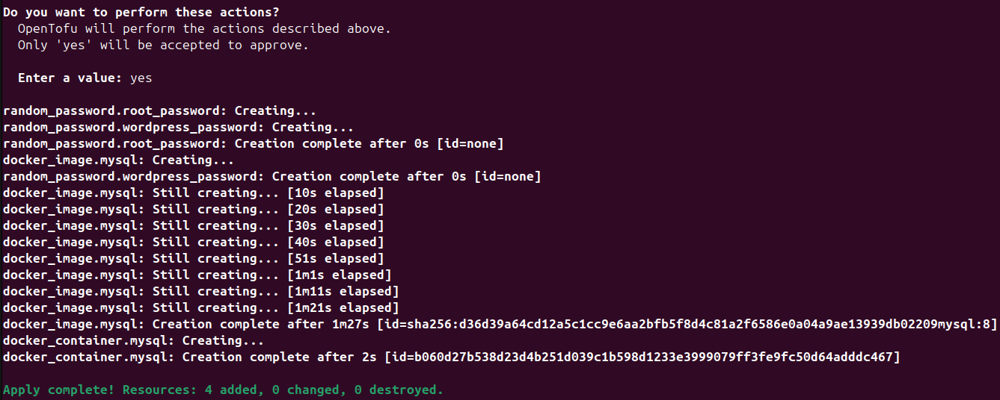

# Домашнее задание к занятию «Введение в Terraform»

# Задание 1

## 1. Установка Terraform

Установлена Terraform версии **1.12.1**, что соответствует требованиям задания (>=1.12.0).

### Скриншот



---

## 2. В каком файле можно хранить секретные данные?

Согласно содержимому файла `.gitignore`, секретную информацию (логины, пароли, токены, ключи и т.д.) допустимо хранить в файле:

```text
personal.auto.tfvars
```

Данный файл исключён из Git и не попадёт в репозиторий.

---

## 3. Секрет из terraform.tfstate

После выполнения команды

```bash
terraform apply
```

в файле `terraform.tfstate` был найден секрет ресурса `random_password.random_string`.

**Ключ:**

```text
result
```

**Значение:**

```text
iuYpJx8sKnV5uGBQ
```

---

## 4. Ошибки после раскомментирования блока

После выполнения команды

```bash
terraform validate
```

были обнаружены следующие ошибки.

### Ошибка №1

Отсутствовало локальное имя ресурса.

Было:

```hcl
resource "docker_image" {
```

Исправлено:

```hcl
resource "docker_image" "nginx" {
```

---

### Ошибка №2

Имя ресурса начиналось с цифры.

Было:

```hcl
resource "docker_container" "1nginx" {
```

Исправлено:

```hcl
resource "docker_container" "nginx" {
```

---

### Ошибка №3

Использовалась ссылка на несуществующий ресурс.

Было:

```hcl
name = "example_${random_password.random_string_FAKE.resulT}"
```

Исправлено:

```hcl
name = "example_${random_password.random_string.result}"
```

После исправления конфигурация успешно прошла проверку.

### Скриншот



---

## 5. Выполнение проекта

Исправленный фрагмент кода:

```hcl
resource "docker_image" "nginx" {
  name         = "nginx:latest"
  keep_locally = true
}

resource "docker_container" "nginx" {
  image = docker_image.nginx.image_id
  name  = "example_${random_password.random_string.result}"

  ports {
    internal = 80
    external = 9090
  }
}
```

После выполнения команды

```bash
terraform apply
```

контейнер был успешно создан.

### Скриншот



---

## 6. Изменение имени контейнера

Имя контейнера было изменено на

```text
hello_world
```

После выполнения команды

```bash
terraform apply -auto-approve
```

контейнер был успешно пересоздан.

### Скриншот



---

### Для чего нужен ключ `-auto-approve`

По умолчанию Terraform перед применением изменений показывает план выполнения и ожидает подтверждения пользователя.

Ключ

```text
-auto-approve
```

отключает запрос подтверждения и сразу начинает применение изменений.

### Возможная опасность

Использование данного ключа может привести к случайному удалению или изменению инфраструктуры без возможности проверить план выполнения.


---

## 7. Удаление ресурсов

После выполнения команды

```bash
terraform destroy
```

Terraform успешно удалил все созданные ресурсы.

### Скриншот



---

### Содержимое terraform.tfstate

После удаления ресурсов файл имеет следующий вид:

```json
{
  "version": 4,
  "terraform_version": "1.12.1",
  "serial": 11,
  "lineage": "a1dfb306-8347-f4b3-358a-b756d955fe0f",
  "outputs": {},
  "resources": [],
  "check_results": null
}
```

---

## 8. Почему Docker-образ не удалился?

В конфигурации ресурса используется параметр

```hcl
resource "docker_image" "nginx" {
  name         = "nginx:latest"
  keep_locally = true
}
```

Параметр

```text
keep_locally = true
```

указывает Terraform **не удалять Docker-образ** из локального хранилища при выполнении `terraform destroy`.

При этом Terraform удаляет ресурс из своего состояния (`terraform.tfstate`), поэтому отображается сообщение об успешном удалении ресурса.

---

### Документация Terraform Docker Provider

Для ресурса `docker_image` в документации указано:

> **keep_locally** — *If true, then the Docker image won't be deleted on destroy operation.*


---

# Задание 2*

**Ссылка на код:**  
https://github.com/kefffirchik/ter-homeworks/blob/main/01/terraform-remote-docker/main.tf

---

## 1. Создание виртуальной машины

Виртуальная машина была создана в Яндекс Облаке через web-консоль.

Параметры ВМ:

- ОС — Ubuntu 24.04
- vCPU — 2
- RAM — 2 ГБ
- Диск — 20 ГБ
- Публичный IP — назначен автоматически

### Скриншот



---

## 2. Установка Docker

После подключения к ВМ по SSH был установлен Docker.

Проверка установки:

```bash
docker version
docker ps
```

Docker установлен и готов к работе.

---

## 3. Подключение Terraform к удалённому Docker через SSH

Для подключения Terraform к удалённому Docker Engine был использован Docker Provider с подключением по SSH.

Конфигурация провайдера:

```hcl
provider "docker" {
  host = "ssh://user@51.250.82.250:22"
}
```

Terraform выполняется на локальной машине, а управление Docker осуществляется на удалённой виртуальной машине через SSH.

---

## 4. Генерация паролей

Для генерации секретных данных использовались два ресурса `random_password`.

```hcl
resource "random_password" "root_password" {
  length  = 20
  special = false
}

resource "random_password" "wordpress_password" {
  length  = 20
  special = false
}
```

Таким образом были созданы разные пароли для:

- `MYSQL_ROOT_PASSWORD`
- `MYSQL_PASSWORD`

---

## 5. Создание контейнера MySQL

Использовался образ:

```text
mysql:8
```

Контейнер создавался со случайным именем:

```hcl
name = "example_${random_password.root_password.result}"
```

Передаваемые переменные окружения:

```hcl
env = [
  "MYSQL_ROOT_PASSWORD=${random_password.root_password.result}",
  "MYSQL_DATABASE=wordpress",
  "MYSQL_USER=wordpress",
  "MYSQL_PASSWORD=${random_password.wordpress_password.result}",
  "MYSQL_ROOT_HOST=%"
]
```

Порт MySQL опубликован только на localhost виртуальной машины:

```hcl
ports {
  internal = 3306
  external = 3306
  ip       = "127.0.0.1"
}
```

После выполнения команды

```bash
terraform apply
```

контейнер был успешно создан.

### Скриншот



---

## 6. Проверка переменных окружения

Для проверки переданных переменных окружения была выполнена команда:

```bash
docker exec -it example_<random_password> env
```

В контейнере присутствуют все необходимые переменные:

- `MYSQL_ROOT_PASSWORD`
- `MYSQL_DATABASE`
- `MYSQL_USER`
- `MYSQL_PASSWORD`
- `MYSQL_ROOT_HOST`

### Скриншот



---

## Итог

В результате выполнения задания:

- создана виртуальная машина в Яндекс Облаке;
- установлен Docker;
- настроено подключение Terraform к удалённому Docker Engine по SSH;
- создан контейнер `mysql:8`;
- сгенерированы два различных пароля с помощью `random_password`;
- секретные значения переданы в контейнер через переменные окружения;
- выполнена проверка наличия ENV-переменных внутри контейнера.

---

# Задание 3*

## Установка OpenTofu

Была установлена OpenTofu версии **1.12.3**.

### Скриншот



---

## Выполнение проекта

Для проверки совместимости тот же проект был выполнен с использованием OpenTofu.

Вместо команды:

```bash
terraform apply
```

использовалась команда:

```bash
tofu apply
```

Конфигурация была успешно применена, контейнер создан без изменений, что подтверждает совместимость OpenTofu с используемой конфигурацией Terraform.

### Скриншот



---
