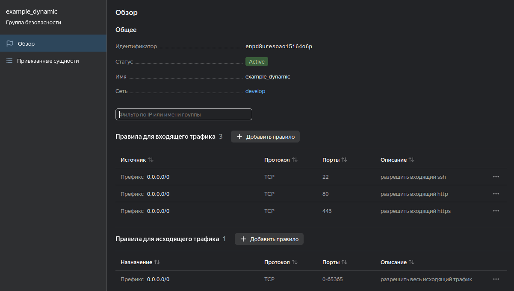
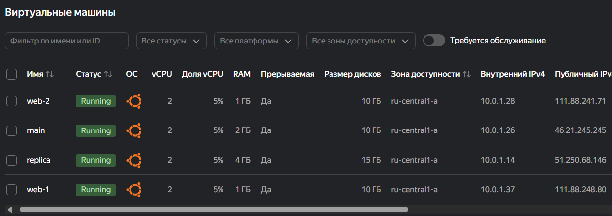
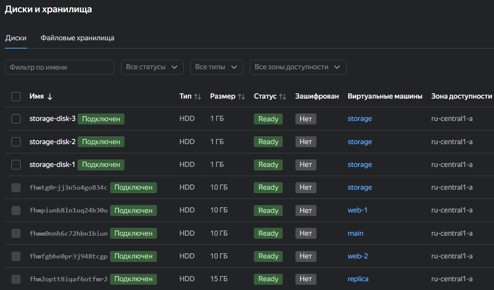

# Домашнее задание к занятию «Управляющие конструкции в коде Terraform»

## Задание 1

Проект был инициализирован и успешно применён.

Использованные команды:

```bash
terraform init
terraform plan
terraform apply
```

В результате были созданы:

- VPC-сеть `develop`;
- подсеть `develop`;
- группа безопасности `example_dynamic`.

В группе безопасности настроены следующие входящие правила:

| Протокол | Порт | Источник |
|----------|-----:|----------|
| TCP | 22 | `0.0.0.0/0` |
| TCP | 80 | `0.0.0.0/0` |
| TCP | 443 | `0.0.0.0/0` |

### Скриншот



---

## Задание 2

Создан файл `count-vm.tf`, в котором с использованием мета-аргумента `count` созданы две одинаковые виртуальные машины:

- `web-1`;
- `web-2`.

К виртуальным машинам подключена группа безопасности, созданная в задании 1.

Создан файл `for_each-vm.tf`, в котором с использованием мета-аргумента `for_each` созданы две виртуальные машины баз данных:

- `main`;
- `replica`.

Параметры виртуальных машин задаются общей переменной:

```hcl
variable "each_vm" {
  type = list(object({
    vm_name     = string
    cpu         = number
    ram         = number
    disk_volume = number
  }))
}
```

Виртуальные машины `web-*` создаются после `main` и `replica` с помощью `depends_on`.

Для чтения публичного SSH-ключа используется функция `file()` в локальной переменной.

### Скриншот



---

## Задание 3

Создан файл `disk_vm.tf`.

С помощью ресурса `yandex_compute_disk` и мета-аргумента `count` создаются три одинаковых диска размером 1 ГБ:

```hcl
resource "yandex_compute_disk" "storage" {
  count = 3

  name = "storage-disk-${count.index + 1}"
  size = 1
}
```

Создана одиночная виртуальная машина `storage`.

Для подключения дополнительных дисков используется блок `dynamic secondary_disk` и мета-аргумент `for_each`:

```hcl
dynamic "secondary_disk" {
  for_each = yandex_compute_disk.storage

  content {
    disk_id = secondary_disk.value.id
  }
}
```

В результате к виртуальной машине `storage` автоматически подключаются три дополнительных диска.

### Скриншот



---

