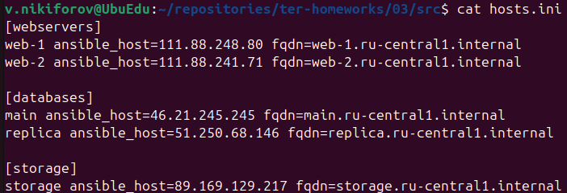
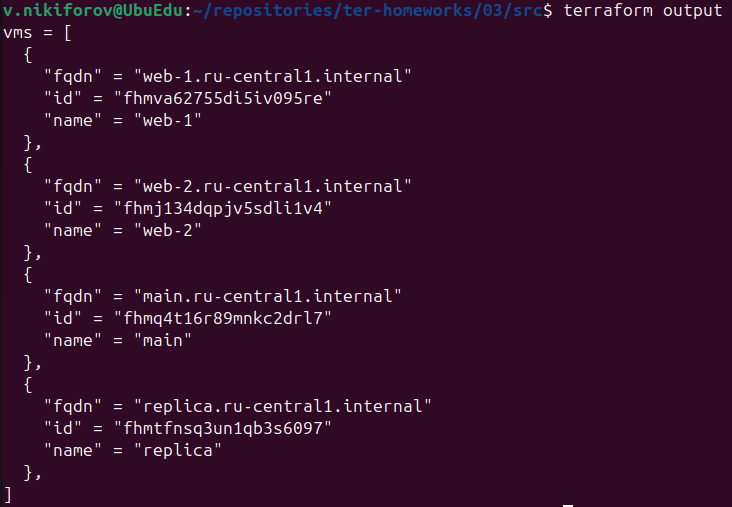

# Домашнее задание к занятию «Управляющие конструкции в коде Terraform»

## Задание 1

Проект был инициализирован и успешно применён.

Использованные команды:

```bash
terraform init
terraform plan
terraform apply
```

В результате были созданы:

- VPC-сеть `develop`;
- подсеть `develop`;
- группа безопасности `example_dynamic`.

В группе безопасности настроены следующие входящие правила:

| Протокол | Порт | Источник |
|----------|-----:|----------|
| TCP | 22 | `0.0.0.0/0` |
| TCP | 80 | `0.0.0.0/0` |
| TCP | 443 | `0.0.0.0/0` |

### Скриншот


---

## Задание 2

Создан файл `count-vm.tf`, в котором с использованием мета-аргумента `count` созданы две одинаковые виртуальные машины:

- `web-1`;
- `web-2`.

К виртуальным машинам подключена группа безопасности, созданная в задании 1.

Создан файл `for_each-vm.tf`, в котором с использованием мета-аргумента `for_each` созданы две виртуальные машины баз данных:

- `main`;
- `replica`.

Параметры виртуальных машин задаются общей переменной:

```hcl
variable "each_vm" {
  type = list(object({
    vm_name     = string
    cpu         = number
    ram         = number
    disk_volume = number
  }))
}
```

Виртуальные машины `web-*` создаются после `main` и `replica` с помощью `depends_on`.

Для чтения публичного SSH-ключа используется функция `file()` в локальной переменной.

### Скриншот


---

## Задание 3

Создан файл `disk_vm.tf`.

С помощью ресурса `yandex_compute_disk` и мета-аргумента `count` создаются три одинаковых диска размером 1 ГБ:

```hcl
resource "yandex_compute_disk" "storage" {
  count = 3

  name = "storage-disk-${count.index + 1}"
  size = 1
}
```

Создана одиночная виртуальная машина `storage`.

Для подключения дополнительных дисков используется блок `dynamic secondary_disk` и мета-аргумент `for_each`:

```hcl
dynamic "secondary_disk" {
  for_each = yandex_compute_disk.storage

  content {
    disk_id = secondary_disk.value.id
  }
}
```

В результате к виртуальной машине `storage` автоматически подключаются три дополнительных диска.

### Скриншот


---

## Задание 4

Создан файл `ansible.tf`, формирующий динамический inventory-файл Ansible с использованием функции `templatefile()`.

Создан шаблон `hosts.tftpl`, который автоматически формирует группы виртуальных машин независимо от их количества.

В итоговый inventory включены три группы:

- `webservers`;
- `databases`;
- `storage`.

Для каждой виртуальной машины выводятся:

- имя;
- внешний IP-адрес (`ansible_host`);
- полное доменное имя (`fqdn`).

Полученный файл `hosts.ini`:

### Скриншот



---


## Задание 5*

Создан output `vms`, отображающий виртуальные машины, созданные с использованием ресурсов `count` и `for_each`, в виде списка словарей.

Для формирования списка используется функция `concat()`, объединяющая результаты двух циклов:

- по ресурсу `yandex_compute_instance.web`, созданному с помощью `count`;
- по ресурсу `yandex_compute_instance.db`, созданному с помощью `for_each`.

Каждый элемент списка содержит:

- имя виртуальной машины;
- идентификатор;
- внутреннее доменное имя (`fqdn`).

### Скриншот



---

## Задание 6*

В файл `ansible.tf` добавлен ресурс `null_resource`, использующий провижионер `local-exec` для автоматического запуска Ansible Playbook после создания инфраструктуры.

Для формирования inventory используется функция `templatefile()` и шаблон `hosts.tftpl`.

Запуск Ansible выполняется командой:

```hcl
provisioner "local-exec" {
  command = <<-EOT
    ANSIBLE_HOST_KEY_CHECKING=False ansible-playbook \
      -i ${local_file.ansible_inventory.filename} \
      ${path.module}/test.yml \
      --private-key ~/.ssh/id_ed25519 \
      -u ubuntu
  EOT
}
```

В шаблоне `hosts.tftpl` реализован автоматический выбор адреса для подключения:

- при наличии внешнего IP используется `nat_ip_address`;
- при отсутствии внешнего IP используется внутренний `ip_address`.

```hcl
ansible_host=${vm.network_interface[0].nat_ip_address != "" ? vm.network_interface[0].nat_ip_address : vm.network_interface[0].ip_address}
```

Работа `null_resource` проверена успешным запуском Ansible Playbook для всех созданных виртуальных машин.

После изменения параметра `nat = false` для всех виртуальных машин inventory автоматически переключается на использование внутренних IP-адресов, что позволяет использовать его при работе через bastion-сервер.

---

## Задание 7*

Выражение для удаления третьего элемента из списков `subnet_ids` и `subnet_zones`:

```hcl
merge(local.vpc, {
  subnet_ids = concat(
    slice(local.vpc.subnet_ids, 0, 2),
    slice(local.vpc.subnet_ids, 3, length(local.vpc.subnet_ids))
  )

  subnet_zones = concat(
    slice(local.vpc.subnet_zones, 0, 2),
    slice(local.vpc.subnet_zones, 3, length(local.vpc.subnet_zones))
  )
})
```

---
